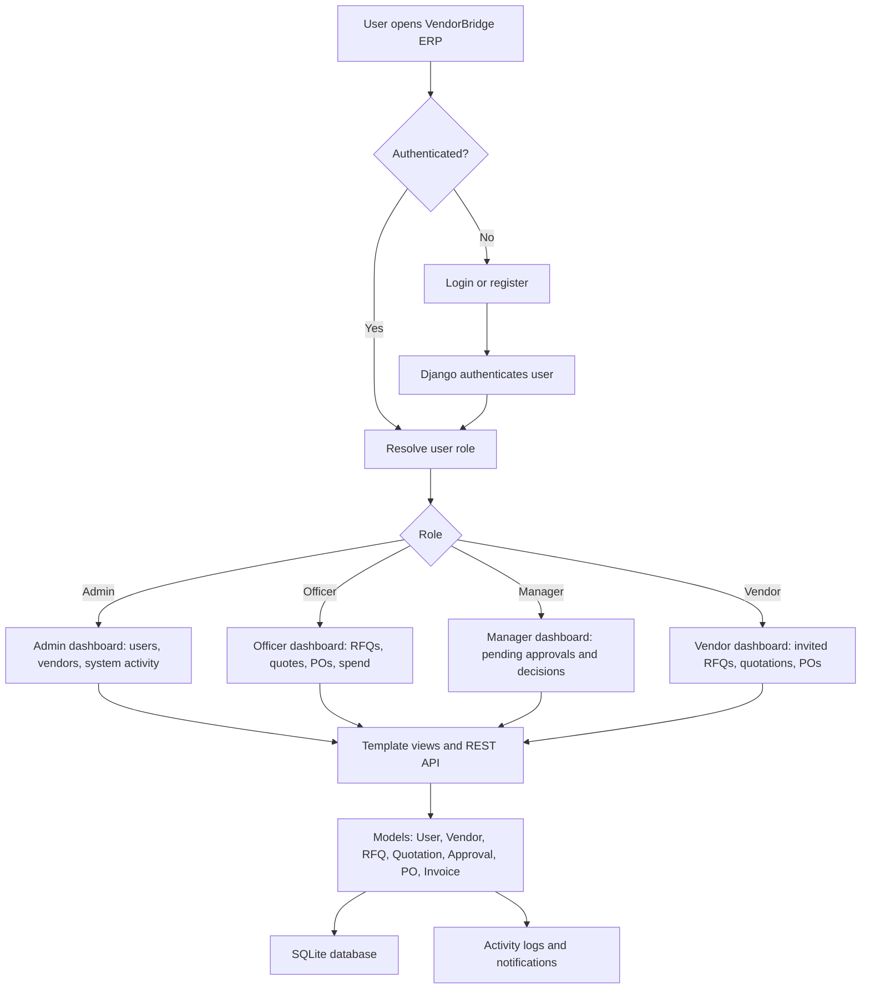
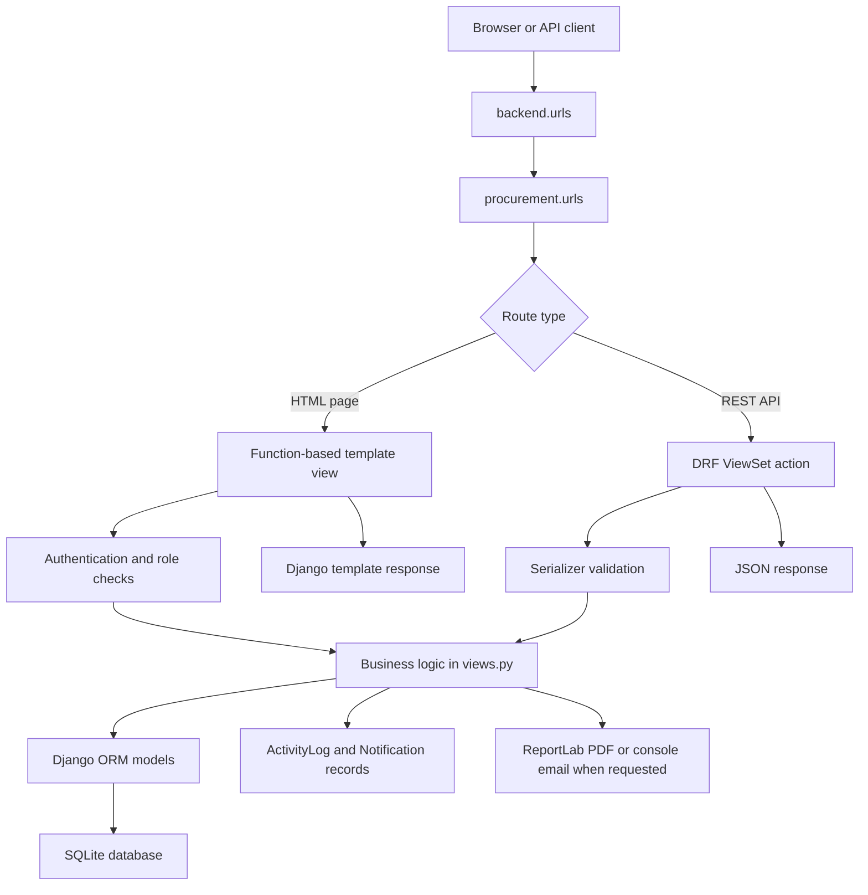
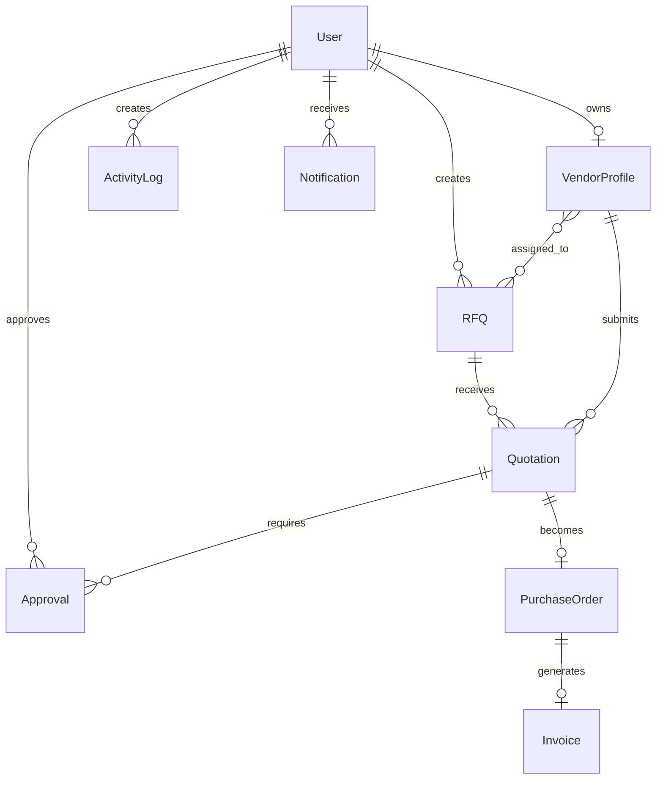

# VendorBridge ERP

VendorBridge ERP is a Django-based procurement management system for running an end-to-end purchasing cycle: vendor onboarding, RFQ creation, quotation collection, quote comparison, approval, purchase order generation, invoicing, reporting, notifications, and audit logging.

The project contains a server-rendered web dashboard and a Django REST Framework API in the same `procurement` app.

## Tech Stack

- Python
- Django
- Django REST Framework
- SQLite
- ReportLab for PDF generation
- Console email backend for local email simulation
- Server-rendered Django templates
- Chart data prepared in Django views for dashboard/report pages

## Project Structure

```text
Odoo/
|-- backend/
|   |-- settings.py
|   |-- urls.py
|   |-- asgi.py
|   `-- wsgi.py
|-- procurement/
|   |-- models.py
|   |-- serializers.py
|   |-- views.py
|   |-- urls.py
|   |-- simulation.py
|   |-- admin.py
|   |-- management/commands/seed_db.py
|   |-- templates/procurement/
|   `-- static/procurement/css/styles.css
|-- manage.py
|-- db.sqlite3
|-- test_e2e_cycle.py
|-- test_workflow.py
`-- README.md
```

## Quick Start

1. Create and activate a virtual environment.

```bash
python -m venv .venv
.venv\Scripts\activate
```

2. Install dependencies.

```bash
pip install django djangorestframework django-cors-headers reportlab
```

3. Apply migrations.

```bash
python manage.py migrate
```

4. Seed demo data.

```bash
python manage.py seed_db
```

5. Start the development server.

```bash
python manage.py runserver
```

6. Open the app.

```text
http://127.0.0.1:8000/
```

## Demo Users

The seed command creates these main accounts. All seeded users use:

```text
password123
```

| Role | Email |
|---|---|
| Admin | `admin@vendorbridge.com` |
| Procurement Officer | `officer@vendorbridge.com` |
| Manager / Approver | `manager@vendorbridge.com` |
| Vendor | `nexgen@vendorbridge.com` |
| Vendor | `primeoffice@vendorbridge.com` |
| Vendor | `logistics@vendorbridge.com` |
| Vendor | `apex@vendorbridge.com` |

The UI also supports quick role switching through `/switch-role/?role=Officer`, `/switch-role/?role=Manager`, `/switch-role/?role=Vendor`, and `/switch-role/?role=Admin`.

## High-Level Application Flow



## Procurement Code Flow Chart

```mermaid
flowchart LR
    A["Vendor onboarding"] --> B["VendorProfile created"]
    B --> C["Officer creates RFQ with line items and assigned vendors"]
    C --> D{"Send RFQ now?"}
    D -- "No" --> E["RFQ stays Draft"]
    D -- "Yes" --> F["RFQ status: Sent"]
    E --> F
    F --> G["Vendor notifications created"]
    F --> H["Background simulation can auto-generate vendor quotations"]
    G --> I["Vendor submits quotation"]
    H --> I
    I --> J["Quotation model calculates subtotal, 18% GST, total"]
    J --> K["RFQ status: Received"]
    K --> L["Officer compares quotations"]
    L --> M["Officer shortlists quotation"]
    M --> N["Approval request created for Manager"]
    N --> O{"Manager decision"}
    O -- "Reject" --> P["Quotation rejected; RFQ returns to Received"]
    O -- "Approve" --> Q["Quotation approved; other quotes rejected"]
    Q --> R["Purchase Order generated"]
    R --> S["RFQ status: PO_Generated"]
    S --> T["PO delivery timeline updated"]
    T --> U["Invoice generated from PO"]
    U --> V["Invoice emailed or marked Paid"]
    V --> W["Reports, vendor metrics, audit logs updated"]
```



## Django Request Flow



## Data Model Overview



## Features In Detail

### Authentication and Roles

- Custom `User` model uses email as the login field.
- Supported roles are `Officer`, `Vendor`, `Manager`, and `Admin`.
- Login and registration are available through template views.
- REST API login, registration, and current-user lookup are available through `UserViewSet`.
- Vendor registration automatically creates a `VendorProfile` when the selected role is `Vendor`.
- Role-specific dashboards show different metrics and navigation options.

### Admin Dashboard

- Shows total users, active users, total vendors, active vendors, RFQs, purchase orders, and spend.
- Displays users by role.
- Displays RFQ status distribution.
- Shows recent users, recent vendors, and recent activity logs.
- Admin users can create new users from the Users page.

### Procurement Officer Dashboard

- Shows RFQ counts, open RFQs, submitted quotations, purchase orders, pending approvals, and total spend.
- Displays monthly RFQ creation trend.
- Displays monthly spend trend.
- Displays vendor-wise quotation value comparison.
- Shows recent RFQs, purchase orders, invoices, and activities.

### Vendor Dashboard

- Shows RFQs received, quotations submitted, won quotations, purchase orders received, and pending payments.
- Filters dashboard data to the logged-in vendor profile.
- Displays RFQ participation trend.
- Displays quotation status distribution.
- Shows recent invited RFQs, own quotations, and own purchase orders.

### Manager Dashboard

- Shows pending, approved, and rejected approval counts.
- Shows approved procurement value.
- Displays approval request trend and approval status distribution.
- Lists pending approval requests, past approved requests, rejected requests, and recent activities.

### Vendor Management

- Register vendors with category, GST number, contact details, address, rating, risk score, status, and AI recommendation flag.
- Search vendors by name, GST number, email, or category.
- Filter vendors by category and status.
- Track active, under-review, suspended, and blocked vendors.
- View selected vendor performance details, transactions, invoices, and rating chart data.
- Export the vendor directory as CSV.
- Request approval for a vendor, which creates a manager/admin notification.

### RFQ Management

- Create RFQs with title, description, deadline, assigned active vendors, and dynamic specification line items.
- RFQ line items are stored as JSON with name, specification, quantity, and expected price.
- Save RFQs as `Draft` or publish them immediately as `Sent`.
- Send draft RFQs later.
- Notify assigned vendor users when an RFQ is published.
- Search RFQs by title or RFQ number.
- Filter RFQs by status.
- Vendor users only see assigned non-draft RFQs.
- RFQ numbers are auto-generated in the format `RFQ/2026/0001`.

### Quotation Management

- Vendors submit quotations against assigned RFQs.
- Quotation item prices are captured per RFQ line item.
- The `Quotation.save()` method calculates subtotal, 18% GST, and total price automatically.
- Submitted quotations can move RFQs from `Sent` to `Received`.
- Officers can compare quotations and shortlist one for approval.
- Quote statuses include `Draft`, `Submitted`, `Shortlisted`, `Approved`, and `Rejected`.

### Automated Vendor Bidding Simulation

- Publishing an RFQ can trigger `trigger_simulation(rfq.id)`.
- The simulation runs in a background thread.
- After a short delay, it generates submitted quotations for assigned vendors that have not already quoted.
- Generated pricing varies around the expected item price.
- The simulation creates notifications and activity logs, then moves the RFQ to `Received`.

### Quotation Comparison

- RFQ comparison page loads all quotations for a selected RFQ.
- Calculates expected total from RFQ item quantities and expected prices.
- Builds radar chart data for:
  - Price score
  - Delivery speed
  - Vendor rating
  - Risk mitigation
  - Order history
- Shortlisting a quote creates manager approval records and moves the RFQ to `Compared`.

### Approval Workflow

- Approval requests are assigned to Manager users.
- Managers can approve or reject quotations.
- Approval changes are wrapped in database transactions.
- Approving a quotation:
  - Marks the approval as `Approved`.
  - Marks the quotation as `Approved`.
  - Rejects competing quotations for the same RFQ.
  - Marks the RFQ as `Approved`.
  - Notifies the procurement officer and vendor.
- Rejecting a quotation:
  - Marks the approval as `Rejected`.
  - Marks the quotation as `Rejected`.
  - Returns the RFQ to `Received` for alternative comparison.

### Purchase Orders

- Purchase orders are created from approved quotations.
- PO numbers are auto-generated in the format `PO/2026/0001`.
- Creating a PO updates the related RFQ to `PO_Generated`.
- PO statuses include `Draft`, `Confirmed`, `Shipped`, `Received`, and `Invoiced`.
- Timeline status supports progression through `Confirmed`, `Shipped`, `Received`, and `Invoiced`.
- Purchase order detail data includes vendor rank, approval reference, quotation reference, vendor performance score, savings amount, savings percentage, risk score, and expected delivery date.
- POs can be emailed through the console email backend.
- POs can generate invoices.
- API endpoint supports PO PDF download through ReportLab.

### Invoices

- Invoices are generated from purchase orders.
- Invoice numbers are auto-generated in the format `INV-2026-0001`.
- Invoice totals are copied from the related quotation.
- Invoice statuses include `Draft`, `Posted`, `Paid`, and `Cancelled`.
- Invoices can be emailed through the console email backend.
- Invoices can be marked as paid.
- Vendor users see only invoices linked to their vendor profile.
- API endpoint supports invoice PDF download through ReportLab.

### Reports and Analytics

- Reports page summarizes procurement by category:
  - IT Hardware
  - Office Supplies
  - Services & Logistics
  - Facilities & Work
- Calculates order count, target budget, actual spend, savings, and savings percentage.
- Prepares chart data for category spend and savings distribution.
- Provides a summary ledger across all categories.

### Activity Logs

- Major events create `ActivityLog` records:
  - User registration and login
  - Vendor registration and status updates
  - RFQ creation and publishing
  - Quotation submission and shortlisting
  - Approval decisions
  - PO generation and timeline updates
  - Invoice generation, email, and payment
- The Activity page lists logs in reverse chronological order.

### Notifications

- Notifications are created for important user-facing events:
  - New RFQ invitation
  - Quotation submitted
  - Approval request
  - Approval or rejection decision
  - Purchase order issued
  - Invoice generated
- The REST API filters notifications to the resolved current user.
- API includes a `mark_all_read` action.

### Settings

- Users can update profile information.
- Email uniqueness is validated during profile updates.
- Users can change passwords.
- Password change validates current password, confirmation match, and minimum length.
- Session authentication hash is updated so the user remains logged in after password change.

## HTML Routes

| Route | Purpose |
|---|---|
| `/` | Role-specific dashboard |
| `/login/` | Login page |
| `/register/` | Registration page |
| `/logout/` | Logout |
| `/switch-role/` | Demo role switching |
| `/vendors/` | Vendor directory and vendor actions |
| `/rfqs/` | RFQ list, create, publish, and PO actions |
| `/rfqs/<id>/compare/` | Quote comparison and approval request |
| `/quotations/` | Vendor quotation submission and quotation list |
| `/approvals/` | Manager approval workflow |
| `/purchase-orders/` | Purchase order list and actions |
| `/invoices/` | Invoice list and actions |
| `/reports/` | Procurement reports and analytics |
| `/activity/` | Audit activity log |
| `/users/` | Admin user management |
| `/settings/` | Profile and password settings |

## REST API Routes

All API routes are mounted under `/api/`.

| Resource | Route |
|---|---|
| Users | `/api/users/` |
| Vendors | `/api/vendors/` |
| RFQs | `/api/rfqs/` |
| Quotations | `/api/quotations/` |
| Approvals | `/api/approvals/` |
| Purchase Orders | `/api/pos/` |
| Invoices | `/api/invoices/` |
| Activity Logs | `/api/activities/` |
| Notifications | `/api/notifications/` |

Important custom API actions include:

| Endpoint | Method | Purpose |
|---|---|---|
| `/api/users/register/` | POST | Register a user |
| `/api/users/login/` | POST | Login-style user lookup/auth |
| `/api/users/me/` | GET | Return resolved current user |
| `/api/rfqs/<id>/send_rfq/` | POST | Publish an RFQ and notify vendors |
| `/api/quotations/<id>/submit_quotation/` | POST | Submit quotation |
| `/api/quotations/<id>/submit_for_approval/` | POST | Shortlist quotation and create approvals |
| `/api/approvals/<id>/approve/` | POST | Approve quotation |
| `/api/approvals/<id>/reject/` | POST | Reject quotation |
| `/api/pos/<id>/generate_invoice/` | POST | Generate invoice from PO |
| `/api/pos/<id>/download_pdf/` | GET | Download PO PDF |
| `/api/invoices/<id>/download_pdf/` | GET | Download invoice PDF |
| `/api/invoices/<id>/send_email/` | POST | Send invoice email |
| `/api/notifications/mark_all_read/` | POST | Mark notifications as read |

## Core Status Lifecycles

### RFQ Status

```text
Draft -> Sent -> Received -> Compared -> Approved -> PO_Generated
```

RFQs can also be `Cancelled`.

### Quotation Status

```text
Draft -> Submitted -> Shortlisted -> Approved
```

Quotes can also be `Rejected`.

### Approval Status

```text
Pending -> Approved
Pending -> Rejected
```

### Purchase Order Status

```text
Draft -> Confirmed -> Shipped -> Received -> Invoiced
```

### Invoice Status

```text
Draft -> Posted -> Paid
```

Invoices can also be `Cancelled`.

## Testing

Run Django unit tests:

```bash
python manage.py test
```

Run the model-level end-to-end procurement cycle script:

```bash
python test_e2e_cycle.py
```

Run the browser-style workflow script after starting the development server:

```bash
python manage.py runserver
python test_workflow.py
```

## Notes

- The project uses SQLite for local development.
- `ALLOWED_HOSTS` is set to `*` and `DEBUG` is enabled, so this configuration is for local/demo use.
- Email sending uses Django's console backend, so emails print to the terminal instead of being sent externally.
- Permissions are intentionally permissive in the API (`AllowAny`) for local presentation/demo usage.
- Some dashboard chart data is synthesized where the underlying model does not store the required timestamp, such as vendor registration trend.
